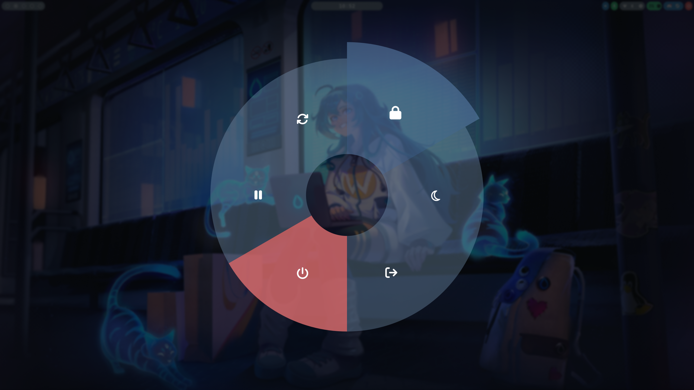

# SNMenu - Circular Menu for Wayland

A modern circular menu for Wayland desktop environments. Built in Rust with GTK3 and Cairo. Use it as a power menu, application launcher (replacing rofi/dmenu), or any general-purpose command launcher.

Inspired by [wlogout](https://github.com/ArtsyMacaw/wlogout).

## Features

- Circular Layout - Semi-transparent donut ring design
- General-Purpose - Works as power menu, app launcher, or custom command menu
- Customizable Buttons - JSON configuration for any commands and actions
- Smooth Animations - Fast, responsive interface
- Keyboard Shortcuts - Quick access with configurable key bindings
- Themeable - GTK CSS styling support
- Fully Customizable - Per-button colors and icons
- Wayland Native - Built for modern Wayland compositors

## Screenshots



A circular menu layout with wedge-shaped buttons arranged in a ring pattern.

## Installation

### From AUR

```bash
paru -S snmenu
```

Then use the custom compiled binary:

```bash
sudo cp target/release/snmenu /usr/local/bin/
```

### Build from Source

Clone this repository and build:

```bash
git clone https://github.com/Sleep-No-More/SNMenu.git
cd SNMenu
cargo build --release
sudo cp target/release/snmenu /usr/local/bin/
```

### Dependencies

- Rust 1.70 or later
- GTK3 development libraries (libgtk-3-dev)
- Cairo development libraries (libcairo2-dev)

## Configuration

### Layout File

Location: ~/.config/snmenu/layout

JSON array format:

```json
[
    {
        "label": "lock",
        "action": "hyprlock",
        "text": "Lock",
        "keybind": "l",
        "color": "#E07070",
        "hover_color": "#DC5050",
        "icon_char": "\u{f023}"
    },
    {
        "label": "shutdown",
        "action": "systemctl poweroff",
        "text": "Shutdown",
        "keybind": "s",
        "color": "#E07070",
        "hover_color": "#DC5050",
        "icon_char": "\u{f011}"
    }
]
```

Button properties:

- **label**: Unique identifier for button styling
- **action**: Command to execute
- **text**: Display text on button
- **keybind** (optional): Keyboard shortcut character
- **color** (optional): Button color in hex format (e.g., "#81A1C1")
- **hover_color** (optional): Color when hovering, in hex format
- **icon_char** (optional): Custom icon character (Unicode or Nerd Font symbol)
- **icon_path** (optional): Path to custom icon image file

See [CUSTOMIZATION.md](CUSTOMIZATION.md) for detailed customization options and examples.

### Style File

Location: ~/.config/snmenu/style.css

Customize button appearance using GTK CSS.

## Hyprland Integration

### Waybar Integration

Add a custom widget to ~/.config/waybar/config.jsonc:

```jsonc
"custom/menu": {
    "format": "Menu",
    "on-click": "snmenu -l ~/.config/snmenu/layout -C ~/.config/snmenu/style.css"
}
```

## Usage

Menu controls:

- Keyboard - Use configured key bindings
- Mouse - Click buttons or press Esc to close
- Hover - Visual feedback on button hover

## Use Cases

### Power Menu (Default)

Configure shutdown, reboot, suspend, and lock commands:

```json
[
    {
        "label": "shutdown",
        "action": "systemctl poweroff",
        "text": "Shutdown",
        "color": "#DC143C",
        "hover_color": "#8B0000",
        "icon_char": "\u{f011}"
    }
]
```

### Application Launcher (Replace rofi)

Use as a fast app launcher with custom applications:

```json
[
    {
        "label": "browser",
        "action": "firefox",
        "text": "Firefox",
        "color": "#FF7F50",
        "hover_color": "#FF6347",
        "icon_char": "\u{f269}"
    },
    {
        "label": "terminal",
        "action": "kitty",
        "text": "Terminal",
        "color": "#2E8B57",
        "hover_color": "#228B22",
        "icon_char": "\u{f18e}"
    }
]
```

### Quick Commands

Create a menu of frequently used commands:

```json
[
    {
        "label": "screenshot",
        "action": "grim -g \"$(slurp)\" - | wl-copy",
        "text": "Screenshot",
        "color": "#8B008B",
        "icon_char": "\u{f03e}"
    },
    {
        "label": "volume",
        "action": "pavucontrol",
        "text": "Volume",
        "color": "#4169E1",
        "icon_char": "\u{f028}"
    }
]
```

## Color Customization

Button colors and icons are now fully customizable through the layout configuration file:

- **Per-button colors**: Set custom base and hover colors for each button
- **Custom icons**: Use Unicode symbols, Nerd Font icons, or custom image files
- **Fallback defaults**: Smart defaults applied if colors/icons not specified

Example with custom colors:

```json
{
    "label": "suspend",
    "action": "sudo systemctl suspend",
    "text": "Suspend",
    "color": "#2E8B57",
    "hover_color": "#228B22",
    "icon_char": "\u{f04c}"
}
```

For detailed customization guide, see [CUSTOMIZATION.md](CUSTOMIZATION.md).

For advanced styling, also modify the stylesheet in ~/.config/cpmenu/style.css.

Note: Requires JetBrainsMono Nerd Font for best icon rendering.

## Project Structure

- src/main.rs - Main application with UI and color logic
- src/circular_layout.rs - Circular button layout rendering
- src/config.rs - Configuration loading and color parsing
- layout - Default button configuration (JSON array)
- style.css - GTK CSS styling
- Cargo.toml - Rust dependencies and project metadata

## Performance

- Smooth 60 FPS rendering with Cairo
- Low CPU usage
- Fast startup time
- Minimal memory footprint

## Troubleshooting

### Configuration not loading

Verify layout and style files exist at configured paths.

### CSS styling not applied

Ensure style.css syntax is valid GTK CSS.

## Development

### Building for Development

```bash
cargo build
./target/debug/snmenu
```

### Building Release

```bash
cargo build --release
./target/release/snmenu
```

### Testing Custom Changes

```bash
# Test with specific layout
./target/debug/snmenu -l ~/.config/snmenu/layout -C ~/.config/snmenu/style.css

# With debug logging
RUST_LOG=debug ./target/debug/snmenu
```

## License

SNMenu is released under the MIT License. See LICENSE file for details.
